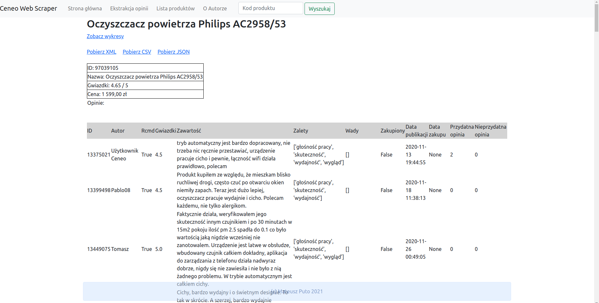

# CeneoWebScraper
This is university project.

### How to run this site on your computer
Linux env.: Download the files from the repository. Change your location to the downloaded folder and open the terminal.
Next type and open link that shows up in the terminal:
> export FLASK_APP=app

> flask run

*Fig 1.1 Preview of the site*
_____________________________________________

### Cel aplikacji
Aplikacja pozwala na ekstrakcję opinii o wybranym produkcie z serwisu internetowego Ceneo.pl, a także wyświetlenie ich, pobranie w wybranym formacie oraz podstawową analizę.

### Opis działania aplikacji
Aby pobrać informacje o produkcie należy udać się do zakładki "Ekstrakcja opinii" gdzie po wpisaniu odpowiedniego kodu produktu, zostaniemy przekierowani na stronę wyświetlającą wszystkie opinie. Aby uzyskać kod interesującego produktu wyszukujemy go w serwisie Ceneo a następnie kopiujemy ostatni fragment adresu url. Na przykład jeśli szukany przez na produkt znajduje się pod adresem https://ceneo.pl/1111 to wpisujemy w pole "1111". Analogicznie dla innych id produktów. Strona oferuje możliwość przeglądania wcześniej pobranych produktów w zakładce "Lista produktów". Klikając na nazwę produktu możemy tam otworzyć wcześniej pobrane opinie. Dla każdego produktu wyświetlane są podstawowe informacje o nim, opinie które możemy posortować wybierając i naciskając na odpowiednią nazwę kolumny w tabeli. Dodatkowo możemy zobaczyć prostą analizę opinii dla każdego produktu, otwierając link "Zobacz wykresy" dostępny na podstronie odpowiedniego produktu.

### Zastosowane biblioteki
beautifulsoup4==4.9.3, bs4==0.0.1, certifi==2020.12.5, chardet==4.0.0, click==8.0.1, colorama==0.4.4, cycler==0.10.0, dicttoxml==1.7.4, Flask==2.0.1, idna==2.10, itsdangerous==2.0.1, Jinja2==3.0.1, json2xml==3.6.0, kiwisolver==1.3.1, MarkupSafe==2.0.1, matplotlib==3.4.2, npm==0.1.1, numpy==1.20.3, optional-django==0.1.0, pandas==1.2.4, Pillow==8.2.0, pyparsing==2.4.7, python-dateutil==2.8.1, pytz==2021.1, requests==2.25.1, six==1.16.0, soupsieve==2.2.1, urllib3==1.26.4, Werkzeug==2.0.1, xmltodict==0.11.0

### Zastosowane podejście
Aplikacja internetowa, oparta o framework Flask. Forma webowa pozwala na łatwe poruszanie się po aplikacji i wygodne wprowadzanie, odczytywanie oraz pobieranie danych. Dla koniecznego zarządzania danymi, jak i ich preprocessingu został wykorzystany język Python z jego licznymi bibliotekami. W zapisie informacji korzystamy z obiektowości i różnych formatów danych.
